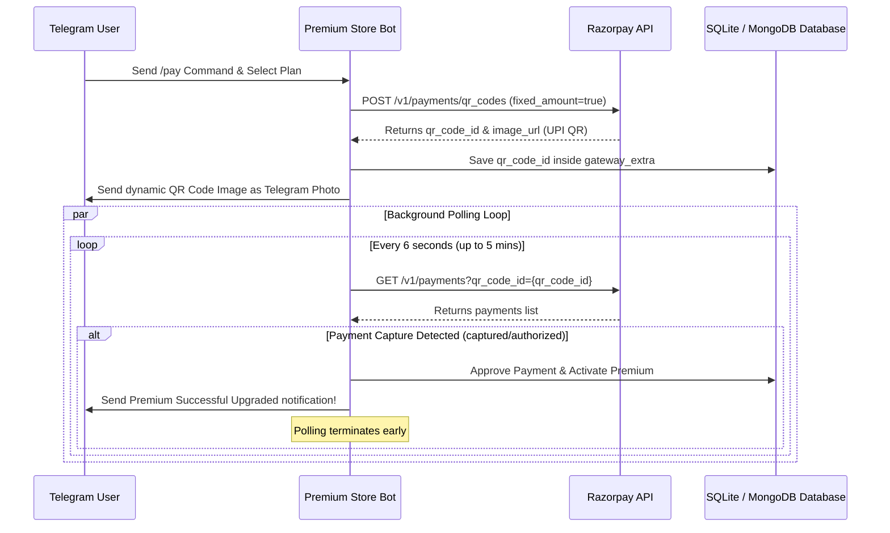

# Razorpay UPI QR Integration Implementation Plan

This document outlines the architecture, setup process, database schemas, and codebase enhancements used to integrate Razorpay dynamic UPI QR codes inside the `filepremiumstore` Telegram bot.

---

## 1. Architectural Overview



---

## 2. Key Enhancement Actions

### 2.1 API Integration Service (`bot/razorpay_service.py`)
- Created a custom asynchronous REST client using native `aiohttp`.
- Implements `/v1/payments/qr_codes` for dynamic generation.
- Implements polling mechanism checking `/v1/payments?qr_code_id={qr_code_id}` to verify payment capture in the background.

### 2.2 Environment Variables & Config (`bot/config.py` & `.env.example`)
- Introduced `RAZORPAY_KEY_ID` and `RAZORPAY_KEY_SECRET`.
- Configured dynamic routing under `PAYMENT_GATEWAY=razorpay`.

### 2.3 Database Management (`bot/db.py`)
- Programmed a lightweight SQLite migration creating `gateway_extra TEXT` on startup.
- Updated retrieval functions and built safe database updates saving the generated QR credentials.

### 2.4 User Handlers (`bot/handlers.py`)
- Handled UI lifecycle, sending high-resolution QR photo directly as a media message.
- Plugged the non-blocking polling sequence into Python's `asyncio.create_task` pipeline.

---

## 3. Configuration & Deployment

### 3.1 Setup Environment Variables
Add your Razorpay credentials to your production `.env` file:
```ini
PAYMENT_GATEWAY=razorpay
RAZORPAY_KEY_ID=rzp_live_xxxxxxxxxxxxxx
RAZORPAY_KEY_SECRET=xxxxxxxxxxxxxxxxxxxxxxxx
```

### 3.2 Dynamic Plan Price Matching
The bot automatically reads the price configurations from `PAY_PLANS` dictionary in `bot/handlers.py` and matches payments to Razorpay dynamically:
- **1 Day**: ₹10
- **7 Days**: ₹35
- **30 Days**: ₹115

---

> [!IMPORTANT]
> The dynamic QR code generated is **Single-Use** and tagged with the user's details inside Razorpay Notes. This guarantees seamless payment security and prevents transaction collusion or fraud.
